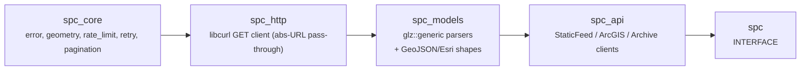

# spc-cpp

[](https://github.com/Reddimus/spc-cpp/actions/workflows/ci.yml)
[](https://github.com/Reddimus/spc-cpp/releases)
[](https://en.cppreference.com/w/cpp/23)
[](https://opensource.org/licenses/MIT)

C++23 SDK for [NOAA Storm Prediction Center](https://www.spc.noaa.gov/)
(SPC) severe-weather products: convective outlooks (Day 1-3 categorical &
probabilistic, Day 4-8, conditional intensity), fire-weather outlooks,
active watches, mesoscale discussions, and storm reports.

Typed, `std::expected`-based access over three sources: the **ArcGIS
MapServer** (`mapservices.weather.noaa.gov`, primary — contract-stable),
the static **`www.spc.noaa.gov` GeoJSON feeds** (fallback), and the
**IEM archive** (`mesonet.agron.iastate.edu`, historical backfill). No
API key required.

## Quick Start

```cpp
#include "spc/spc.hpp"
#include <iostream>

int main() {
    spc::HttpClient http; // absolute-URL pass-through; serves SPC/ArcGIS/IEM

    spc::Result<spc::HttpResponse> r = http.get(
        "https://www.spc.noaa.gov/products/outlook/day1otlk_cat.nolyr.geojson");
    if (!r) {
        std::cerr << r.error().message << "\n";
        return 1;
    }
    if (r->status_code == 404) {
        // SPC's normal "no active outlook" state — clear, don't error.
        return 0;
    }

    const spc::CategoricalOutlookPayload p =
        spc::parse_categorical(r->body, /*day_offset=*/1);
    for (const spc::OutlookFeature& f : p.features) {
        std::cout << f.label << " (severity " << static_cast<int>(f.severity)
                  << ") rings=" << f.rings.size() << "\n";
    }
}
```

## Features

- **C++23** with `Result<T> = std::expected<T, Error>` for all fallible
  APIs (no exceptions across the public surface).
- **Convective outlooks**: Day 1-3 categorical + probabilistic
  (tornado/hail/wind), Day 4-8, conditional intensity.
- **Fire weather, watches, mesoscale discussions, storm reports**
  (the mesoscale-discussion narrative is exposed raw — not parsed).
- **Three sources, one client**: `ArcGISClient` (+ `ArcGISPager` for
  the 2000-record transfer limit), `StaticFeedClient`, `ArchiveClient`
  (IEM, conservative rate/retry).
- Ray-cast **point-in-polygon** + Polygon/MultiPolygon geometry.
- Battle-tested NOAA-GeoJSON parsing: case-variant keys
  (`LABEL`/`label`/`dn`), numeric-as-string labels, polymorphic
  geometry — lifted verbatim from a production ingestion service.

## Install

### CMake `find_package`

```bash
cmake -B build -DCMAKE_BUILD_TYPE=Release
cmake --build build
cmake --install build --prefix /your/prefix
```

```cmake
find_package(spc 0.1.0 REQUIRED)
target_link_libraries(myapp PRIVATE spc::spc)
```

### FetchContent

```cmake
FetchContent_Declare(spc_cpp
    GIT_REPOSITORY https://github.com/Reddimus/spc-cpp.git
    GIT_TAG v0.1.0  # pin a tagged release
)
FetchContent_MakeAvailable(spc_cpp)
target_link_libraries(myapp PRIVATE spc::spc)
```

## Architecture



Layered static libraries with `install(EXPORT)` and a `spc::` namespace.

## JSON library: Glaze (divergence note)

**spc-cpp parses JSON with [Glaze](https://github.com/stephenberry/glaze)
v7.6.0, not `nlohmann/json`.** This is a deliberate divergence from the
sibling Reddimus SDKs `nws-cpp` and `ncei-cpp`, which use
`nlohmann/json`.

Why: SPC's GeoJSON `properties` block is shape-loose — the same logical
field appears as `LABEL`, `label`, or `dn` depending on the product; a
probabilistic label is sometimes the string `"5"` and sometimes the
number `5`; timestamps are a compact `YYYYMMDDHHMM`; and geometry is
polymorphic (`Polygon` vs `MultiPolygon`). A compile-time
`glz::meta` schema would either reject these or force tagged-variant
gymnastics. Instead the parser walks a `glz::generic` AST with
null-safe extractors (missing/null/type-mismatch → default-constructed
value). This is the exact, audit-clean code path proven in the internal
`spc-data` ingestion service; it is lifted **verbatim** so a downstream
consumer that swaps its in-tree copy for this SDK gets byte-identical
parse output. Net-new product models reuse the same `glz::generic`
helpers but **do not** reuse the convective `severity_from_label`
(different label sets — they carry product-specific severity mappers).

If you vendor multiple Reddimus SDKs via FetchContent, note that
spc-cpp pins the **same** glaze `v7.6.0` tag the rest of the estate
uses, so a combined build dedupes to a single `glaze::glaze` target.

## Build & Test

```bash
make build      # Release
make test       # ctest
make lint       # clang-format --dry-run + cpp_auto_audit
make coverage   # lcov report
```

## Dependencies

| Dependency | Purpose | Source |
| ---------- | ------- | ------ |
| [Glaze](https://github.com/stephenberry/glaze) v7.6.0 | JSON (generic-AST parse of shape-loose SPC GeoJSON) | `FetchContent` |
| libcurl | HTTP GET | system (`find_package(CURL)`) |
| GoogleTest v1.15.2 | Unit testing | `FetchContent` |

## References

- [SPC Products](https://www.spc.noaa.gov/products/)
- [NWS ArcGIS MapServer — SPC outlooks](https://mapservices.weather.noaa.gov/vector/rest/services/outlooks/SPC_wx_outlks/MapServer)
- [IEM SPC archive](https://mesonet.agron.iastate.edu/)

## License

MIT — see [LICENSE](LICENSE).
